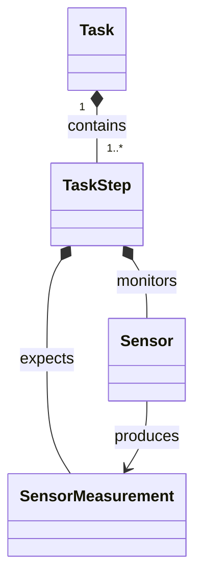
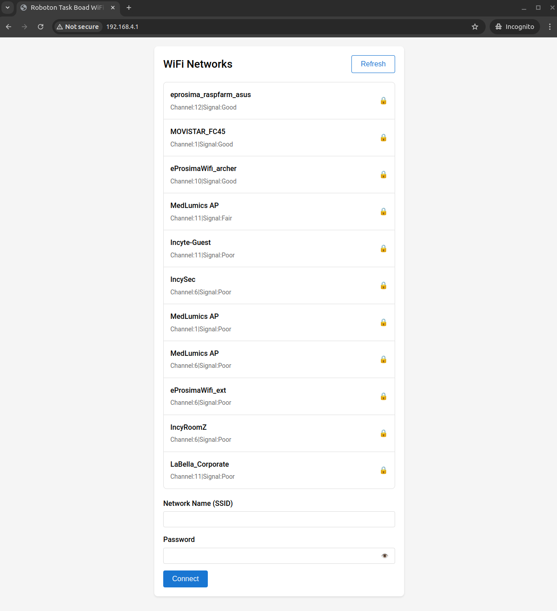
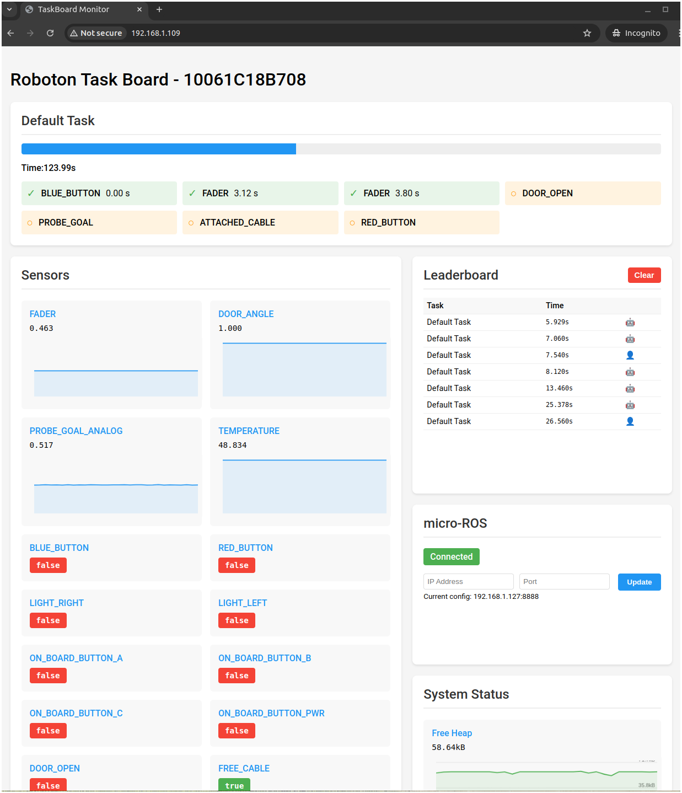

# Robothon Task Board Firmware

A flexible and extensible firmware for Robothon Task Board.

Noteworthy features:

- Configurable task execution system with configurable patterns
- Modular sensor monitoring framework based on M5Stack
- REST API and Web Interface for remote control
- ROS 2 integration with custom message types
- Leaderboard logging and performance tracking

## Table of Contents

- [Robothon Task Board Firmware](#robothon-task-board-firmware)
  - [Table of Contents](#table-of-contents)
  - [Build firmware](#build-firmware)
  - [Data Model Overview](#data-model-overview)
    - [SensorMeasurement](#sensormeasurement)
    - [Sensor](#sensor)
    - [TaskStep](#taskstep)
    - [Task](#task)
  - [Controller Architecture Overview](#controller-architecture-overview)
    - [TaskBoardDriver](#taskboarddriver)
      - [Default Task](#default-task)
    - [ScreenController](#screencontroller)
    - [TaskExecutor](#taskexecutor)
    - [NonVolatileStorage](#nonvolatilestorage)
    - [HTTPServer](#httpserver)
    - [JSONHandler](#jsonhandler)
    - [WifiManager](#wifimanager)
    - [micro-ROS controllers](#micro-ros-controllers)
  - [Accessing the data model](#accessing-the-data-model)
    - [Example applications](#example-applications)
      - [REST API](#rest-api)
      - [Getting status from ROS 2](#getting-status-from-ros-2)
      - [Triggering a new Task from ROS 2](#triggering-a-new-task-from-ros-2)
      - [Triggering Task Board default task from ROS 2](#triggering-task-board-default-task-from-ros-2)
  - [Common actions](#common-actions)
    - [Connecting to a Wi-Fi network](#connecting-to-a-wi-fi-network)
    - [Connecting to a micro-ROS Agent](#connecting-to-a-micro-ros-agent)
      - [Using Docker](#using-docker)
      - [Building the micro-ROS Agent](#building-the-micro-ros-agent)
      - [Configuring the micro-ROS Agent](#configuring-the-micro-ros-agent)
    - [Recording a ROS 2 session](#recording-a-ros-2-session)
  - [Over-The-Air (OTA) updates](#over-the-air-ota-updates)
  - [Developing the Web Interface](#developing-the-web-interface)

## Build firmware

The Robothon Task Board Firmware is built on top of the ESP-IDF framework.

The easiest way to get started is to use the ESP-IDF Docker image:

```bash
# Enter ESP-IDF Docker image
docker run -it --rm -v /dev:/dev --privileged espressif/idf:release-v5.3

# Install dependencies inside the Docker container
pip3 install catkin_pkg lark-parser colcon-common-extensions empy==3.3.4

# Clone the repository
git clone https://github.com/peterso/robotlearningblock

# Initialize the submodules
cd robotlearningblock
git submodule update --init --recursive

# Change to the project directory
cd /robotlearningblock/idf/taskboard

# Configure the project
idf.py build flash monitor
```

## Data Model Overview

The Robothon Task Board Firmware is built around a hierarchical data model where **Tasks** is the main component.

A **Task** is a named group of **TaskSteps** that must be completed in an specific order.

A **TaskStep** is a single condition that must be met during task execution.
It is composed of a **Sensor** and a **SensorMeasurement**.

It is fulfilled when the **Sensor** reading matches the expected value defined in the **SensorMeasurement**.

A **Sensor** represents a physical or aggregated input device that can be read, updated, and monitored.

An example of a physcal **Sensor** can be a button attached to a GPIO.
On the other hand an aggregated **Sensor** can be a virtual sensor that combines multiple physical sensors, for example the activation of two buttons at the same time.

A **SensorMeasurement** represents a single reading from a sensor.

This element holds a value and a type.
Types can be boolean values, analog values or even complex values like a 3D vector.



### SensorMeasurement

**SensorMeasurement** are represented globally in `SensorMeasurement` class found in `sensor/SensorMeasurement.hpp`.

Current implementation has support for:

| Type      | Description   | C++ Type                     |
| --------- | ------------- | ---------------------------- |
| `BOOLEAN` | Boolean value | `bool`                       |
| `ANALOG`  | Analog value  | `float`                      |
| `VECTOR3` | 3D vector     | `SensorMeasurement::Vector3` |


### Sensor

**Sensor** are represented globally in `Sensor` class found in `sensor/Sensor.hpp`.

Beyond that, there is also provided a `AnalogFilteredSensor` class in`sensor/AnalogFilteredSensor.hpp` that extends `Sensor` and adds a averaging filter to the analog readings.

### TaskStep

**TaskStep** are represented globally in `TaskStep` class found in `task/TaskStep.hpp`.

Currently, there are three types of `TaskStep`:

- `TaskStepEqual`: Exact value matching with configurable tolerance.
- `TaskStepGreaterEqualThan`: Threshold monitoring for analog values.
- `TaskStepEqualToRandom`: Exact value matching for random target.

**TaskSteps** can be extended by creating new classes that inherit from `TaskStep`.

### Task

**Task** are represented globally in `Task` class found in `task/Task.hpp`.

Three types of `Task` are provided:

- `SequentialTask`: Steps must be completed in order.
- `ParallelTask`: Steps can be completed in any order.
- `SimultaneousConditionTask`: All conditions must be satisfied simultaneously.

**Tasks** can be extended by creating new classes that inherit from `Task`.

## Controller Architecture Overview

The Robothon Task Board Firmware implements a set of modular controllers that manage different aspects of the system and interacts with the data model.

### TaskBoardDriver

A **TaskBoardDriver** is an interface that describes certain configuration of a Task Board.
It is resposible for creating and updating a set of **Sensor** objects.

Currently a single implementation is provided in `TaskBoardDriver_v1` class found in `hal/board/TaskBoardDriver_v1.hpp`.

#### Default Task

The **TaskBoardDriver** implementation is in charge of providing a default **Task** that will be executed.
This default taks is the one that can be started just by pressing the button on the Task Board.

This default task may require some preconditions to be met before it can be executed, that is a certain well known Task Board state.

### ScreenController

The **ScreenController** is an object that handles the display output of the Task Board.

### TaskExecutor

The **TaskExecutor** is an object that handles that execution of a **Task**.

This component will be responsible for monitoring the status of a **Task** and update other elements of the system (such as the **ScreenController**) accordingly.

### NonVolatileStorage

THe **NonVolatileStorage** is an object that handles the persistance of data.

### HTTPServer

The **HTTPServer** is an interface that handles HTTP requests.

This element will serve the REST API and Web Interface.

Check section [Developing the Web Interface](./web_interfaces/README.md) for more information.

### JSONHandler

The **JSONHandler** is a helper class that converts the Data Model to and from JSON.

### WifiManager

The **WifiManager** is an object that handles the network connectivity of the Task Board.

### micro-ROS controllers

The Robothon Task Board Firmware provides a ROS 2 integration that allows the system to communicate with other ROS 2 nodes by means of micro-ROS.

In order to implement the ROS 2 integration the following classes are provided:

- `MicroROSTypes`: Conversions between micro-ROS and Robothon Task Board data types.
- `MicroROSController`: Handles micro-ROS Client status, micro-ROS Agent connection, and creation and destruction of micro-ROS entities.
- `MicroROSTask`: An specialization of `Task` that allows to create a `Task` from a ROS 2 action.
- `MicroROSTaskExecutor`: Coordinates the interaction between the `TaskExecutor` and the `MicroROSController` by means of handling the `MicroROSTask` lifecycle.

Beyond that classes, a comprehensive translation of the Task Board data model to ROS 2 messages is provided in `extra_ros_packages/robothon_taskboard_msgs` package.

## Accessing the data model

The Robothon Task Board Firmware exposes two primary interfaces for accessing the data model:

- **REST API**: Provides a set of endpoints for interacting with the system via HTTP requests.
- **ROS 2 Integration**: Allows the system to communicate with other ROS 2 nodes.

This two interfaces exposes access and control over the system and the data model in the following way:

| Action                            | REST API            | ROS 2                                                                      |
| --------------------------------- | ------------------- | -------------------------------------------------------------------------- |
| Task Board Status                 | `/taskboard_status` | `/robothon_taskboard_status [robothon_taskboard_msgs/msg/TaskBoardStatus]` |
| Current Task Status               | `/task_status`      | `/robothon_task_status [robothon_task_msgs/msg/TaskStatus]`                |
| Execute a new Task <sup>1</sup>   | Not available       | `/taskboard_execute_task [robothon_taskboard_msgs/action/ExecuteTask]`     |
| Leaderboard                       | `/leaderboard`      | Not available                                                              |
| System Status                     | `/system_status`    | Not available                                                              |
| Configure micro-ROS Agent address | `/microros`         | Not available                                                              |


<sup>1</sup> An empty call to this interface will trigger the default task.

### Example applications

#### REST API

An example of a webpage that consumes the REST API can be found in `web_interfaces` folder.

This webpage is also served by the **HTTPServer** controller in the endpoint `/`.


#### Getting status from ROS 2

For subscribing to the Task Board status, you can use the following command:

```bash
ros2 topic echo /robothon_taskboard_status
```

or

```bash
ros2 topic echo /robothon_task_status
```

#### Triggering a new Task from ROS 2

An example of a ROS 2 application that sends a new Task to the Task Board can be found in `extra_ros_packages/robothon_taskboard_goal_sender` folder.

This example application can be built as a normal ROS 2 package and run as a node:

```bash
# Build the ROS 2 package
cd extra_ros_packages
colcon build

# Source the ROS 2 workspace
source install/local_setup.bash

# Run the ROS 2 node
ros2 run robothon_taskboard_goal_sender goal_sender
```

#### Triggering Task Board default task from ROS 2

An ROS 2 application that triggers the Task Board default task can be found in `extra_ros_packages/robothon_taskboard_default_task_sender` folder.

This example application can be built as a normal ROS 2 package and run as a node:

```bash
# Build the ROS 2 package
cd extra_ros_packages
colcon build

# Source the ROS 2 workspace
source install/local_setup.bash

# Run the ROS 2 node
ros2 run robothon_taskboard_default_task_sender goal_sender
```

## Common actions

Robothon Task Board Firmware assummes that every **TaskBoardDriver** implementation will have the following buttons registered as sensors:

- `BUTTON_A`: M5Stack button A
- `BUTTON_B`: M5Stack button B
- `BUTTON_PWR`: M5Stack power button
- `RED_BUTTON`: On board red button
- `BLUE_BUTTON`: On board blue button

By means of these buttons, the following basic configuration actions can be performed:

| Action                            | Trigger                                                           |
| --------------------------------- | ----------------------------------------------------------------- |
| Reset WiFi and start provisioning | Press `RED_BUTTON` and `BLUE_BUTTON` at the same time during boot |
| Start in local mode (No Wifi)     | Press `BUTTON_A` during boot                                      |
| Start default task                | Press `BUTTON_B`                                                  |
| Start default task (human mode)   | Press `BUTTON_B` and `BUTTON_PWR` at the same time                |
| Cancel current task               | Press `BUTTON_A`                                                  |

### Connecting to a Wi-Fi network

After the Task Board is started in provisioning mode, it will create a Wi-Fi network.

The board will notify in its screen the SSID of the new network and the IP address of the board.

By reaching the IP address of the board in a web browser, the Web Interface will be shown:



### Connecting to a micro-ROS Agent

> [!IMPORTANT]
Ensure that the micro-ROS Agent version matches the ROS 2 distribution.

#### Using Docker

In order to **connect to a micro-ROS Agent** to start the ROS 2 integration, an micro-ROS Agent can be instantiated using docker:

```bash
docker run -it --rm --privileged --net=host --ipc host microros/micro-ros-agent:$ROS_DISTRO udp4 --port 8888 -v4
```

#### Building the micro-ROS Agent

Also, the micro-ROS Agent can be built locally:

```bash
# Install dependencies
apt update
apt install ros-$ROS_DISTRO-micro-ros-msgs

# Create a workspace
mkdir -p microros_agent_ws/src
cd microros_agent_ws

# Clone the micro-ROS Agent
git clone -b $ROS_DISTRO https://github.com/micro-ROS/micro-ROS-Agent.git src/micro-ROS-Agent

# Build the micro-ROS Agent
source /opt/ros/$ROS_DISTRO/setup.bash
colcon build
```

After building the micro-ROS Agent, it can be started using:

```bash
cd microros_agent_ws

source /opt/ros/$ROS_DISTRO/setup.bash
source install/local_setup.bash

ros2 run micro_ros_agent micro_ros_agent udp4 --port 8888 -v5
```

#### Configuring the micro-ROS Agent

The IP address and port of the micro-ROS Agent can be configured using the Web Interface or the REST API.



### Recording a ROS 2 session

To record a ROS 2 session the usage of [Vulcanexus Recorder & Replay](https://docs.vulcanexus.org/en/jazzy/rst/introduction/tools/recordreplay.html).

To use the recorder, the easiest way is using docker:

```bash
cd robotlearningblock/idf/taskboard
docker run -it --rm --privileged --net host --ipc host  -v $(pwd)/extra_ros_packages/record_replay_session:/shared_folder eprosima/vulcanexus:jazzy-desktop ddsrecorder -c /shared_folder/config.yml
```

To allow the DDS Recorder to append custom ROS 2 types into `.mcap` file (to use them in platforms such as Foxglove Studio), ensure that the following command is run at least once during the recording session:

```bash
cd robotlearningblock/idf/taskboard
docker run -it --rm --privileged --net host --ipc host  -v $(pwd)/extra_ros_packages:/shared_folder eprosima/vulcanexus:jazzy-desktop bash /shared_folder/record_replay_session/match_topic_types.sh
```

Former command will generate a .mcap file in the `extra_ros_packages/record_replay_session` folder.

In order to replay the session, the following command can be used:

```bash
docker run -it --rm --privileged --net host --ipc host  -v $(pwd)/extra_ros_packages/record_replay_session:/shared_folder eprosima/vulcanexus:jazzy-desktop ddsreplayer -i /shared_folder/[session_name]
```

**Remember to add extra topics to `extra_ros_packages/record_replay_session/config.yml` if they need to be recorded**

## Over-The-Air (OTA) updates

The Robothon Task Board Firmware supports Over-The-Air (OTA) updates.

The OTA update procedure relies on Github Releases and the ESP-IDF OTA mechanism.

The followinf steps are done to perform an OTA update:

1. The Task Board is connected to a Wi-Fi network.
2. The newest release information is retrieved using HTTPS for a [well-defined end-point](./main/network/OTAUpdater.hpp#L25)
3. The latest release name (in format `vX.Y.Z`) is compared to the [current firmware version](./main/version.hpp).
4. If a newer version is available, the firmware will ask the user to confirm the update using the Task Board buttons and screen.
5. If the user confirms the update, the firmware will download the first asset whose name starts with `taskboard.bin` from the release.
6. After the firmware upgrade is done, the Task Board will reboot and start the new firmware.

## Developing the Web Interface

The Web Interface is served by the **HTTPServer** controller in the endpoint `/`.

The Web Interface is built using Vanilla JavaScript, HTML 5 and CSS 3, in order to keep it simple, lightweight and embeddable in flash memory.

HTML files are stored in the `web_interfaces` folder.
Those files are minified and embedded into a C header file using [`generate_embedded_html.py`](./web_interfaces/generate_embedded_html.py) script.

In order to update the Web Interface, the following steps can be followed:

1. Modify the HTML files in the `web_interfaces` folder.
2. You can use a local web server to test the changes

```bash
cd web_interfaces
python3 -m http.server

# Go to localhost:8000 in your web browser and ensure that "Device IP" (in the bottom left corner) is pointing to the Task Board IP address.
```

3. Run the `generate_embedded_html.py` script to generate the embedded HTML file.
4. Copy the generated `.h` files to the firmware folder: [`main/network/webpages/`](./main/network/webpages/).
5. Rebuild and flash the firmware.